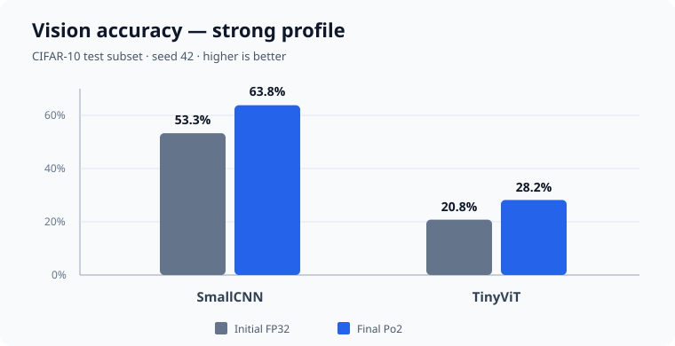
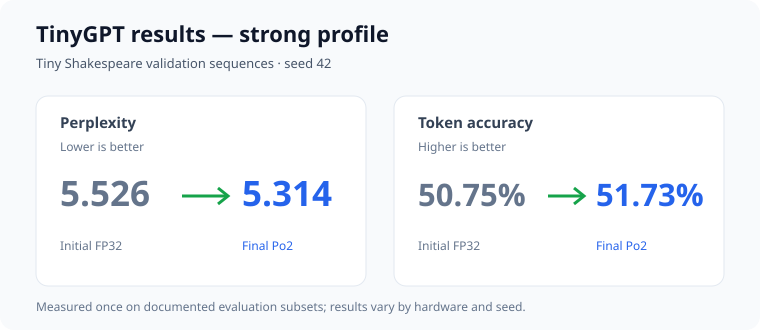

# Po2QAT: Power of Two Quantization Algorithm

A small, reproducible PyTorch project for learning **power-of-two quantization-aware training** (Po2QAT, also written **PoT-QAT** in the literature). It applies the same algorithm to:

1. `MobileNetTiny` — a small MobileNet-style CNN;
2. `TinyViT` — a small Vision Transformer; and
3. `TinyGPT` — a small decoder-only character language model.

Each run saves the weights immediately before QAT, the floating-point master weights after QAT, and the final power-of-two weights. It also creates CSV files so you can inspect actual values without writing Python.

> This is a teaching implementation. It simulates Po2 arithmetic during training and exports a deployment-friendly sign/exponent representation. Ordinary PyTorch inference still uses floating-point kernels, so this repository does **not** claim an automatic runtime speedup.

## What students will learn

- how a signed Po2 codebook represents weights as `0` or `±2^e`;
- how the straight-through estimator (STE) lets gradients pass through rounding;
- the difference between pre-QAT weights, post-QAT master weights, and deployed Po2 weights;
- how quantization affects CNN accuracy, ViT accuracy, and language-model perplexity; and
- how signs and integer exponents can reconstruct every exported Po2 tensor exactly.

## Repository map

```text
po2qat-student-lab/
├── src/po2qat/             algorithm, models, datasets, runner, and CLI
├── tests/                  unit and export tests
├── notebooks/              Jupyter/Colab results lab
├── scripts/                Windows and macOS/Linux setup helpers
├── docs/                   algorithm notes, assignment, dataset/model cards
├── .github/workflows/      Windows, macOS, and Linux test matrix
├── pyproject.toml
└── README.md
```

## 1. Clone the repository

```text
git clone https://github.com/Ikteder/Po2QAT-Power-of-Two-Quantization-Algorithm.git
cd Po2QAT-Power-of-Two-Quantization-Algorithm
```

Use Python **3.10 through 3.14**. Python 3.11 or 3.12 is the safest choice when your course does not specify a version.

## 2. Install it

### Windows PowerShell

```powershell
py -3.12 -m venv .venv
.venv\Scripts\python.exe -m pip install --upgrade pip
.venv\Scripts\python.exe -m pip install -e ".[dev]"
```

If Python 3.12 is not installed, use `py -0p` to list available versions and substitute one of the supported versions.

### macOS Terminal

```bash
python3 -m venv .venv
source .venv/bin/activate
python -m pip install --upgrade pip
python -m pip install -e ".[dev]"
```

Apple Silicon is supported. The program automatically selects Apple MPS when available; use `--device cpu` when exact cross-machine reproducibility matters.

## 3. Verify the installation

Windows:

```powershell
.venv\Scripts\python.exe -m pytest
```

macOS:

```bash
python -m pytest
```

## 4. Choose a model with the interactive launcher

The easiest way to start is to run Po2QAT without arguments. It will ask whether you want the CNN, ViT, or small LLM, followed by the experiment profile.

Windows:

```powershell
.venv\Scripts\python.exe -m po2qat
```

macOS:

```bash
python -m po2qat
```

Example:

```text
Po2QAT interactive launcher
Choose the model you want to run:
  1. CNN — MobileNetTiny image classifier
  2. ViT — Tiny Vision Transformer
  3. LLM — TinyGPT character language model
Model [1/2/3]: 1

Choose an experiment profile:
  1. smoke  — no download; checks that the pipeline works
  2. quick  — short real-data classroom run (default)
  3. strong — measured higher-quality reference schedule
  4. full   — longest run using all available training data
Profile [1/2/3/4, default 2]: 3
```

The program prints progress during baseline training and Po2QAT, shows a concise final comparison, then saves every detailed metric and weight artifact under `runs/<model>/`.

## 5. Run the no-download smoke experiment

This proves that all three pipelines work. It uses deterministic synthetic data, only two baseline updates for TinyGPT, and one short epoch for each vision model. The outputs are structural checks, **not meaningful model quality results**.

Windows:

```powershell
.venv\Scripts\python.exe -m po2qat run --model all --profile smoke --device cpu
```

macOS:

```bash
python -m po2qat run --model all --profile smoke --device cpu
```

## 6. Reproduce the classroom experiments

The `quick` profile downloads CIFAR-10 and Tiny Shakespeare the first time. It uses a fixed CIFAR-10 subset and a fixed seed so it is suitable for a lab period.

```text
python -m po2qat run --model cnn --profile quick --device cpu
python -m po2qat run --model vit --profile quick --device cpu
python -m po2qat run --model llm --profile quick --device cpu
```

For the measured, higher-quality reference configuration, use the `strong` profile. It uses the same fixed classroom datasets but trains longer:

```text
python -m po2qat run --model all --profile strong --device cpu
```

On the reference Windows CPU, the three strong runs took approximately 4.6, 4.9, and 5.2 minutes respectively. See the [measured results](docs/experiments/2026-08-19-real-data-strong-results.md).

### Measured reference charts

These charts summarize the documented, single-seed strong-profile run. They are reproducibility targets, not guaranteed scores: hardware, package versions, and stochastic training can change the result.





On Windows, replace `python` with `.venv\Scripts\python.exe`. On macOS, run these commands after activating the environment.

For a longer experiment using all available training data:

```text
python -m po2qat run --model all --profile full
```

The full profile is intentionally longer. A CPU-only computer may take hours for all three models. You can stop after any individual model; its completed artifacts remain in `runs/`.

## 7. Plot and analyze the run

[](https://colab.research.google.com/github/Ikteder/Po2QAT-Power-of-Two-Quantization-Algorithm/blob/main/notebooks/po2qat_results_lab.ipynb)

The [results notebook](notebooks/po2qat_results_lab.ipynb) can run an experiment and plot initial-versus-Po2 task metrics, training loss, classifier confusion matrices, and all three weight distributions. In Colab, open the badge and run the cells from top to bottom. For local Jupyter:

```text
python -m pip install -e ".[notebook]"
python -m jupyter lab notebooks/po2qat_results_lab.ipynb
```

Choose `MODEL = "cnn"`, `"vit"`, or `"llm"` in section 2 of the notebook. Start with `PROFILE = "quick"`; use `strong` only when you have the documented time budget.

## 8. Inspect the weights

Every model writes to `runs/<model>/`:

| File | Contents |
|---|---|
| `initial_fp32.pt` | Baseline floating-point state immediately before Po2QAT |
| `qat_master_fp32.pt` | Trainable floating-point master state after Po2QAT |
| `po2_quantized.pt` | Materialized state used by the Po2 forward pass |
| `weight_comparison.csv` | Samples from every matrix/kernel: initial, QAT master, and Po2 values side by side |
| `weight_summary.csv` | Shape, errors, exponent range, and exact-Po2 verification for every matrix/kernel |
| `po2_sign_exponent.npz` | Packed sign (`-1,0,+1`) and integer exponent arrays |
| `quantization_metadata.json` | Codebook settings for every quantized module |
| `metrics.json` | Flattened model-quality, environment, and quantization metrics |
| `evaluation.json` | Complete structured comparison of initial FP32, QAT master FP32, and final Po2 states |
| `metrics_comparison.csv` | Side-by-side before/after metrics suitable for Excel or plotting |
| `metric_deltas.csv` | Absolute and percentage changes from initial FP32 to QAT master and final Po2 |
| `per_class_metrics_<state>.csv` | CNN/ViT precision, recall, F1, and support for every CIFAR-10 class |
| `per_class_delta_initial_to_po2.csv` | CNN/ViT per-class precision, recall, and F1 changes |
| `confusion_matrix_<state>.csv` | CNN/ViT confusion matrix for each of the three weight states |
| `quantization_metrics.json` | Weight error, cosine similarity, sparsity, codebook use, and theoretical compression |
| `training_history.csv` | Baseline and QAT training history |
| `config.json` | Complete run configuration and seed |

Open `weight_comparison.csv` in Excel, Numbers, or a text editor. A row such as `-2^-5` means `-0.03125`.

Print a run summary:

```text
python -m po2qat inspect runs/cnn
```

### Metrics produced

For the CNN and ViT, each of the three states reports:

- cross-entropy loss;
- top-1 and top-5 accuracy;
- macro and weighted precision, recall, and F1;
- balanced accuracy;
- per-class precision, recall, F1, and support; and
- a complete 10x10 confusion matrix.

For TinyGPT, each state reports:

- validation cross-entropy loss and perplexity;
- bits per character;
- next-character top-1 and top-5 accuracy;
- evaluated token count, evaluation batches, and context length.

Every model also reports initial-to-Po2 and QAT-master-to-Po2 MAE, RMSE, maximum error, and cosine similarity, along with Po2 zero fraction, nonzero levels used, eligible parameter count, and theoretical eligible-weight compression ratio. “Theoretical” is important: the normal PyTorch checkpoints are not bit-packed runtime files.

### Automatic quality gate

Every run records `quality_gate_passed` and the individual checks in `metrics.json`. The CLI prints a warning if the final Po2 checkpoint fails. For classifiers, the gate permits at most a two-percentage-point accuracy drop and at most a 5% loss increase. For TinyGPT, it permits at most a 5% perplexity increase and a one-percentage-point top-1 token-accuracy drop. A passing gate is a regression safeguard, not proof of state-of-the-art quality.

Load all three checkpoint states in Python:

```python
import torch

initial = torch.load("runs/cnn/initial_fp32.pt", map_location="cpu", weights_only=True)
master = torch.load("runs/cnn/qat_master_fp32.pt", map_location="cpu", weights_only=True)
po2 = torch.load("runs/cnn/po2_quantized.pt", map_location="cpu", weights_only=True)

name = "classifier.weight"
print(initial[name].flatten()[:8])
print(master[name].flatten()[:8])
print(po2[name].flatten()[:8])
```

Reconstruct a tensor from the packed file:

```python
import numpy as np

packed = np.load("runs/cnn/po2_sign_exponent.npz")
sign = packed["classifier__weight__sign"]
exponent = packed["classifier__weight__exponent"]
reconstructed = np.where(sign == 0, 0.0, sign * np.power(2.0, exponent))
print(reconstructed.shape, reconstructed.flatten()[:8])
```

## The algorithm in one minute

For each convolution or linear weight tensor, the program fixes an exponent window from the pre-QAT tensor. With four bits, the codebook has 15 values:

```text
{0, ±2^emin, ±2^(emin+1), ..., ±2^emax}
```

The forward pass rounds each nonzero weight to the nearest allowed power of two. Very small values map to zero. The backward pass uses the STE:

```python
fake_weight = fp_weight + (po2_weight - fp_weight).detach()
```

The forward value is Po2, while the derivative with respect to `fp_weight` is one. See [docs/ALGORITHM.md](docs/ALGORITHM.md) for the exact equations and limitations.

## Reproducibility notes

- The default seed is `42`; change it with `--seed`.
- Dataset selection and batch order use seeded generators.
- `--workers 0` avoids Windows/macOS multiprocessing differences.
- CPU runs are the closest cross-platform comparison. CUDA and MPS can produce small numerical differences.
- The smoke profile tests plumbing only. Report scientific comparisons from `quick` or `full`, and always include the profile, device, package versions, and seed.
- Training from scratch on a small subset is noisy. Do not interpret one run as proof that a model family is inherently more quantization-friendly.

## Common problems

**`No module named po2qat`** — run the editable installation command from the repository root.

**The dataset download fails** — check the network, delete the incomplete `data/cifar-10-*` file or `data/tinyshakespeare/input.txt`, and rerun. The smoke profile requires no download.

**The process runs out of memory** — reduce `--batch-size`, for example `--batch-size 16`.

**MPS operation is unsupported** — rerun with `--device cpu`.

**Windows creates DataLoader errors** — leave `--workers 0` (the default).

## Student assignment

Use the [Po2QAT assignment worksheet](docs/assignments/PO2QAT_ASSIGNMENT.md) for the full procedure, ten analysis questions, submission checklist, and 40-point grading rubric.

See [docs/INSTRUCTOR_GUIDE.md](docs/INSTRUCTOR_GUIDE.md) for grading prompts and [docs/experiments/EXPERIMENT_TEMPLATE.md](docs/experiments/EXPERIMENT_TEMPLATE.md) for a report template.

## References

- Przewlocka-Rus et al., [Power-of-Two Quantization for Low Bitwidth and Hardware Compliant Neural Networks](https://arxiv.org/abs/2203.05025), 2022.
- Elgenedy, [Power-of-Two Quantization-Aware-Training (PoT-QAT) in Large Language Models](https://arxiv.org/abs/2601.02298), 2026.
- PyTorch, [Reproducibility documentation](https://pytorch.org/docs/stable/notes/randomness.html).

## License

Code is released under the [MIT License](LICENSE). Dataset terms are documented separately in [docs/datasets/](docs/datasets/).
